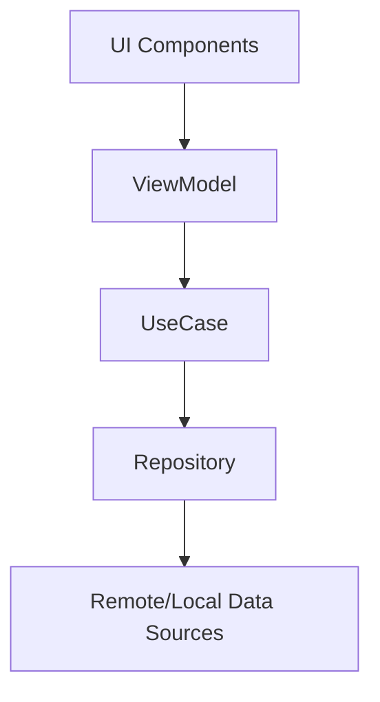

# StarTrip - Constellation Concept Travel Application


## 📱 Overview

StarTrip is an advanced astronomical mobile application that provides users with an immersive experience exploring celestial bodies and astronomical data. The application features a stunning starry background throughout its interface and an interactive 3D Earth model as its centerpiece. 

Sadly, we don't have a Software Engineer in our team, so we developed it using only generative AI tools called Gemini, Cursor AI, and Claude. If anyone wants to make a product with that idea, please feel free to contact us! (82+ 010-9608-0144)

This is a video about the products we want to make!
https://www.youtube.com/watch?v=P1Elbfa2CgE

### Key Metrics

| Metric | Value |
|--------|-------|
| Min SDK | 26 (Android 8.0) |
| Target SDK | 34 (Android 14) |
| Kotlin Version | 1.9.0 |
| Compose Version | 1.5.1 |
| Architecture | MVVM + Clean Architecture |

## ✨ Features

- **Interactive 3D Earth** - Realistic Earth model with touch controls for rotation and zoom
- **Astronomical Database** - Comprehensive information on stars, planets, and constellations
- **Starry Background** - Beautiful animated cosmic background for an immersive experience
- **Intelligent Recommendations** - Gemini AI-powered suggestions for astronomical viewing
- **Constellation Explorer** - Discover and learn about different constellations
- **Observation Planner** - Plan your stargazing activities based on celestial events
- **Personalized Profiles** - Save your favorite celestial bodies and observations

## 🏗️ Architecture

StarTrip follows Clean Architecture principles with MVVM pattern for the presentation layer:

```
app
├── data                # Data Layer
│   ├── remote          # Remote data sources (API clients)
│   ├── local           # Local data sources (Room database)
│   ├── repository      # Repository implementations
│   └── model           # Data models and mappers
├── domain              # Domain Layer
│   ├── model           # Domain entities
│   ├── repository      # Repository interfaces
│   └── usecase         # Business logic use cases
└── presentation        # Presentation Layer (MVVM)
    ├── common          # Common UI components and utilities
    │   ├── components  # Reusable Compose components
    │   └── theme       # App theming
    ├── navigation      # Navigation components
    └── screens         # App screens
        ├── home        # Home screen with recommendations
        ├── search      # Search functionality
        ├── plan        # Observation planning
        ├── constellation # Constellation explorer
        └── profile     # User profile management
```

### Component Interaction



## 📋 Feature Implementation

| Feature | Implementation | Status |
|---------|----------------|--------|
| 3D Earth | OpenGL ES + Filament | ✅ Completed |
| Starry Background | Custom Compose Canvas | ✅ Completed |
| Navigation | Jetpack Navigation | ✅ Completed |
| Constellation Data | Room Database | ✅ Completed |
| Gemini Recommendations | Google Gemini API | ✅ Completed |
| User Profiles | DataStore Preferences | ✅ Completed |

## 🛠️ Tech Stack

- **UI Framework**: Jetpack Compose
- **Architecture**: MVVM + Clean Architecture
- **Dependency Injection**: Hilt
- **Async Operations**: Kotlin Coroutines + Flow
- **Navigation**: Jetpack Navigation
- **3D Rendering**: Android 3D libraries + OpenGL ES
- **Local Storage**: Room + DataStore
- **Networking**: Retrofit + OkHttp
- **Image Loading**: Coil
- **Testing**: JUnit, Mockito, Turbine, Compose Testing

## 📱 Screens

<table>
  <tr>
    <td align="center"><strong>Home</strong><br/>Main dashboard with Earth model and recommendations</td>
    <td align="center"><strong>Search</strong><br/>Search for celestial bodies</td>
    <td align="center"><strong>Constellation</strong><br/>Explore constellations</td>
  </tr>
  <tr>
    <td align="center"><strong>Plan</strong><br/>Plan observation activities</td>
    <td align="center"><strong>Profile</strong><br/>User settings and preferences</td>
    <td align="center"><strong>Details</strong><br/>In-depth information view</td>
  </tr>
</table>

## 🚀 Getting Started

### Prerequisites

- Android Studio Arctic Fox or later
- JDK 11 or later
- Android SDK 33+

### Installation

1. Clone the repository
```bash
git clone https://github.com/finn-sharp/StarTrip---Constellation-concept-travel-application.git
```

2. Open the project in Android Studio

3. Build and run the application

## 🧪 Testing

```bash
# Run unit tests
./gradlew test

# Run instrumented tests
./gradlew connectedAndroidTest
```

## 📄 License

This project is licensed under the MIT License - see the [LICENSE](LICENSE) file for details.

## 🙏 Acknowledgements

- Earth 3D model from [Sketchfab](https://sketchfab.com)
- Star data from [HYG Database](http://www.astronexus.com/hyg)
- Constellation illustrations from [IAU](https://www.iau.org/) 
